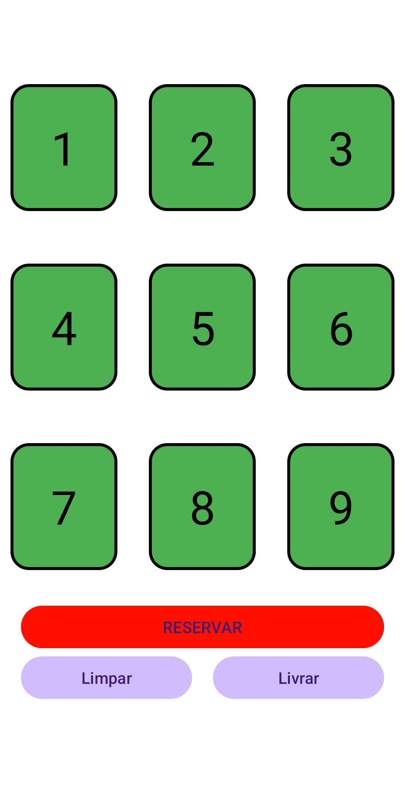
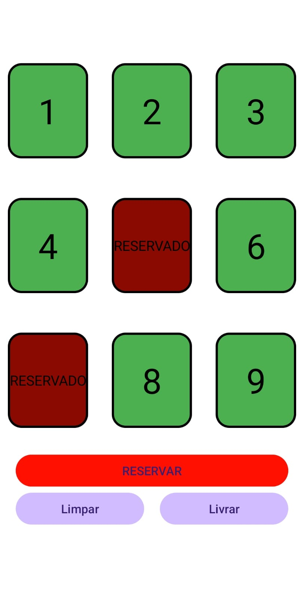

# 🍕 App Restaurante

Aplicativo Android para gerenciamento de mesas.

## 📱 Funcionalidades
- Seleção de mesas
- Reservar mesas
- Remover reservas
- Salvamento com SharedPreferences

## 🛠 Tecnologias
- Java
- Android Studio

## 📸 Imagens

### Tela Inicial

#### Mesa Selecionada

## 🚀 Como executar
1. Clonar o repositório
2. Abrir no Android Studio
3. Executar o projeto
